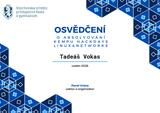
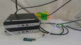
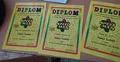
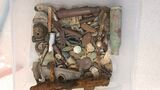

# Portfolio
## programování

- Před pár měsící jsem se začal učit síťování a linux. Velice mě tento operační systém zaujal.
- udělal jsem si také nějaké skripty v bashi, jako na nastavování serveru se statickou IP adresou

- Tomuhle hobby se sice věnuji jen pár měsíců, ale naprosto mě pohltilo. Neskutečně mě baví nad tím přemýšlet, zkoušet si ty věci. A vím, že toto chci v životě dělat. Že tohle se chci učit

- Také jsem tento rok začal pomáhat s nastavením školního hardwaru.

- Self-hostnul jsem si také vlastní "spotify". Jak to funguje? 

- Také mi to jede přes proxy server, který mám nastavený přes nginx. A na self-host appku používám navidrome. Když nejsem doma, na domácí síti. Tak se připojuji přes VPN.

- Také jsem se účastnil Linux hackdays. A utvrdilo mě ještě více, že na vaší škole chci studovat. A rozvíjet se.

  

- Tady také přikládám fotku k mému "labu" v mém pokoji. Mám tady dva minipočítače, kde je proxmox. Potom switch, kde na dvou portech je čistě nativní vlana (ty jdou do mini počítačů)

  

## Speedruning

- Speedruningu se věnuji (on and off) cca. 5 let. Speedrunoval jsem mnoho her. Dlouhé hry, krátké hry. Komplexnější hry, potom zase lehčí hry. Také jsem se v pár hrách účastnil i [online turnajů](https://www.youtube.com/watch?v=sEgdVephpmA) a [maratonů](https://youtu.be/0sFoXdrly_o?si=72uROZTOXXKPhTV7). Nejvíce kompetetivní jsem byl ve hře portal. Kde jsem byl v nejlepším úmístění 25. z cca. 2250 lidí 

- Také jsem [zakládal a připravoval žebříčky pro jednu hru](https://www.speedrun.com/ps5_simulator). A u pár her jsem dělal [České návody na speedruny](https://www.speedrun.com/portal/guides/o2q6p).

- Toto hobby mě naučilo zachovat klidnou hlavu, přizpůsobovat se různým situacím. A hlavně mít trpělivost.

## Speedcubing

- Toto hobby mě poprvé zaujalo cca 4 roky zpátky. Rubikovu kostku každý zná, každy ji jednou zkusil skládat. Já jsem se naučil tuto kostku skládat za jeden večer podle jednoho videa. Pár dní jsem to skládal dokola. A potom jsem chtěl jít hlouběji. Chtěl jsem se naučit skládát tuto kostku rychle. Což  znamenalo naučit se algoritmy, jiné metody, apod. Dneska skládám okolo 12 vteřin. A byl jsem taky na pár turnajích, jak neoficiálních, tak oficiálních. Oficiální turnaje se zapisují do databáze zvané [WCA](https://www.worldcubeassociation.org/persons/2023VOKA01)

- Co mě tohle hobby naučilo? Kritické myšlení. Když mám něco velkého, tak si to nějak rozkouskovat na menší části. A také myšlení pod tlakem.

## Recenzování

- Posledních pár měsíců jsem začal "recenzovat" filmy (a někdy taky hudbu). Proč? Miluju tyto věci, miluju je vnímat. A tak mě napadlo, proč to nějak neshrnout, a nemít to jako nějakou vzpomínku? Popřípadě někoho nalákat na film/album.

- Obecně mám rád věci, u kterých si popřemýšlím, ne jen něco. Na co se kouknu (nebo si poslechnu) a hned to vypustím z hlavy. Převážně píšu v Angličtině, ale České věci píšu v Češtině. 

- Myslím si, že mi to pomohlo vnímat věci více než povrchně. Taky bych řekl, že mi to zlepšilo slovní zásobu. A hlavně taky nějakým způsobem myslet sám za sebe, a nedělat si na nic názor bez toho, abych o tom nevěděl něco více. Nezamyslel se nad tím více
(Profily, kde zveřejňuji své recenze: [Letterboxd](https://letterboxd.com/wocisjr/), [RateYourMusic](https://rateyourmusic.com/~thoughtswithmehehe))
Také jsem psal 16 stránkovou [analýzu na album The Downward Spiral](https://docs.google.com/document/d/1nLFKa6ktUtVb_4BfURdvXvXyiYw39yYN4b7k94QTnv8/edit?usp=sharing)

## Matematika

- Matematika je můj nejoblíbenější školní předmět. Opravdu mě baví logika. 
- doučuji i mé spolužáky (např. moje sestra, která má ADD), a také pro ně připravuji [výuková videa](https://youtu.be/APti7_L02aU?si=lVv7NXMlhYdRoQNy)
- Také se občas doučuji látku navíc. Jako například minulý rok jsem se už učil goniometrické funkce.
- A v roce 2023 jsem se účastnil  matematické soutěžě speedmath, z které jsem dostal 3 diplomy.

  

## Hudba

- Každý poslouchá hudbu, tak proč jsem ji tady zmínil? Protože pro mě je hudba více než zvuk. Mnohdy to pro mě má hodně emocí, hodně myšlenek. Poslední ~2 roky také sbírám fyzické nosiče... převážně CD a vinyly. 

- Zlomový bod v hudbě (a v tom jak ji vnímám) byla kapela Tool. Která mi rozšířila obzory, a ukázala. Že hudba je více než hudba, ale i myšlenka. A spoustu emocí.

  
## Detektoring

- Minulý rok jsem s mým tátou začal chodit na pole s detektorem kovů. Ta elektronika okolo toho je velice fascinující. Je to prakticky čistě o štěstí/o lokalitě. Ale taky je potřeba vědět, jak daný detektor funguje.
- Našli jsme toho už mnoho... přes kusy traktorů, po x let staré stříbrné mince.

   &nbsp; 

## videa

- Dříve jsem točil svá vlastní videa, a také si je stříhal. Samozřejmě, nebyla nějak skvělá, po té kvalitové stránce. Ale v tu dobu mě hodně bavilo si s tím hrát, a učit se nové věci ohledně toho. 

- Před pár měsící jsem se také pomáhal [kamarádovi](https://www.tiktok.com/@morallygray_?_r=1&_t=ZN-92dJFbKBXvy) s videami na tiktoku/instagramu, a za tu dobu, co jsem se tomu věnoval. Jsem nastříhal cca. 30 short-form videí.

## hudební nástroje

 - Dřive jsem se učil na bicí. Vždy mě fascinovaly perkuse. Rytmika. A obecně mám rád písničky, kde jsou perkuse jako dominatní hudební nástroj.

 - Na bicí už nehraji. A momentálně se učím na elektrickou basu. Velice mě baví koukat na hudbu i z tohoto hlediska. A je to něco nového. Nikdy mě moc nebavila ortodoxní metoda typu "Nauč se noty."

