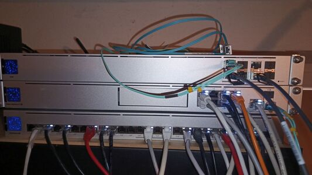
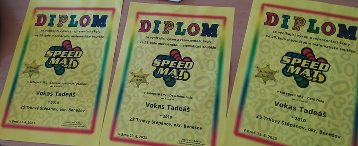
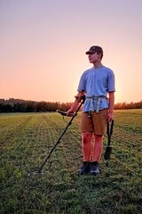
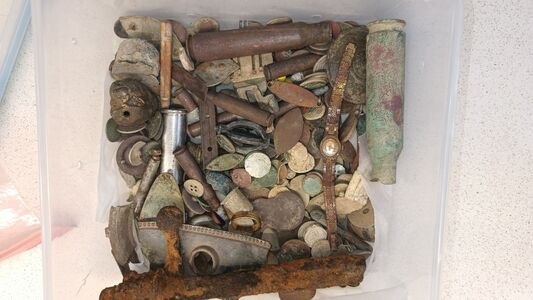
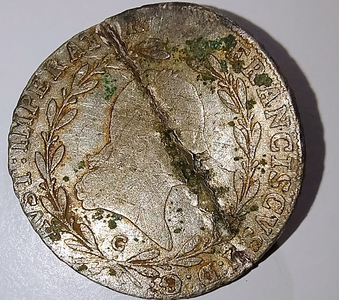
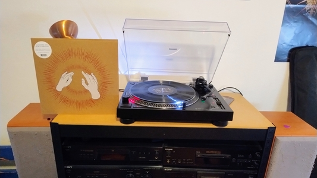

# Portfolio
## Linux
- Již delší dobu se věnuji síťování a Linuxu. Velice mě tento operační systém zaujal.
- Udělal jsem si také nějaké skripty v bashi, pro nastavování serveru se statickou IP adresou, různé úpravy od standartní instalace apod.
- Toto hobby mě neskutečně pohltilo tím, jak je obsáhlé. Neskutečně mě baví nad tím přemýšlet, zkoušet si různé věci. Už teď je mi jasné, že tomuto oboru se chci věnovat i v profesním životě.
- Tento rok jsem začal pomáhat s nastavováním hardware na mé základní škole.
- Self-hostuji si vlastní aplikace, např vlastní "spotify". Jak to funguje? Přístup na něj mám přes proxy server, který mám nastavený přes nginx. Jako server používám navidrome. Když nejsem doma připojuji se přes wireguard VPN.
- Účastnil jsem se Linux hackdays na vaší škole a to mě utvrdilo ještě více, že u vás chci studovat a rozvíjet se.

  

- Pro ukázku fotka linux "labu" v mém pokoji. Mám dva minipočítače, na kterých je nainstalován proxmox jako virtualizační technologie, switch - kde mám nastavenou vlastní separátní VLAN, abych svými pokusy nerozbil zbytek domácí sítě. Na druhé fotce jsou switche domácí sítě, které už také v případě potřeby mohu nastavovat.

  
  

- Pro správu svého labu začínám používat automatizační systém Ansible. Zároveň si vše snažím držet ve svých git repositářích pro lepší přehlednost. GIT jsem začal používat i na své běžné poznámky - viz tento samotný repositář.
- Velkou oporou v tomto koníčku je můj táta, který jako devops/SRE pracuje skoro celý život.
<!-- pagebreak -->

## Matematika
- Matematika je můj nejoblíbenější školní předmět. Opravdu mě baví logika.
- Doučuji i mé spolužáky (např. moji sestru, která má ADD). Také pro ně připravuji [výuková videa](https://youtu.be/APti7_L02aU?si=lVv7NXMlhYdRoQNy)
- Občas se učím látku napřed - minulý rok jsem se sám učil goniometrické funkce.
- V roce 2023 jsem se zúčastnil matematické soutěžě Speedmath, ve které jsem získal 3 diplomy.

  

## Metal Detectoring
- Minulý rok jsem s tátou začal chodit na pole a do lesů se svým detektorem kovů (dříve pouze jako nosič rýče). Ta elektronika okolo je prostě fascinující. Není to čistě o štěstí nebo lokalitě ale také je potřeba vědět, jak daný detektor funguje a jak ho správně nastavit v daných podmínkách.
- Zároveň člověk objevuje historii různých míst a je třeba pro zvýšení šance dobrých nálezů vytipovat zajímavé lokality z historických pramenů (map, kronik...)
- Našli jsme toho už mnoho... přes různé KUTRy (kusy traktorů), po X set let starou stříbrnou minci - což byl shodou okolností jeden z mých prvních nálezů (poslední foto).
- Je to skvělý relax s nádechem tajemna a v zemi je toho ztraceno neuvěřitelně mnoho - prostřední foto cca 2.5kg nálezů za rok 2025.

  
  
  

## Recenzování
- Posledních pár měsíců jsem začal "recenzovat" filmy (a někdy taky hudbu). Proč? Miluju tyto věci, miluju je vnímat. A tak mě napadlo, proč to nějak neshrnout a nemít to jako zachycenou vzpomínku? Popřípadě někoho přivést k filmu/hudbě.
- Obecně mám rád věci, u kterých si popřemýšlím. Ne jen něco, na co se kouknu (nebo si poslechnu) a hned to vypustím z hlavy. Převážně píšu v angličtině, ale českou tvorbu recenzuji v češtině. 
- Myslím si, že mi to pomohlo vnímat věci více než jen povrchně. Také bych řekl, že mi to zlepšilo slovní zásobu. Hlavně nějakým způsobem myslet sám za sebe, nedělat si na nic názor bez toho, abych o tom nezjistil něco více.
(Profily, kde zveřejňuji své recenze: [Letterboxd](https://letterboxd.com/wocisjr/), [RateYourMusic](https://rateyourmusic.com/~thoughtswithmehehe))
- Zatím nejdelší text, který jsem psal, je 16stránková [analýza alba "The Downward Spiral" od kapely Nine Inch Nails](https://github.com/wocisjr/ssps-portfolio/blob/main/documents/My_interpretation_of_The_Downward_Spiral.pdf)
<!-- pagebreak -->

## Hudba
- Každý poslouchá hudbu, tak proč jsem ji tady zmínil? Protože pro mě je hudba více než zvuk. Mnohdy zachycuje hodně emocí, hodně myšlenek. Poslední ~2 roky také sbírám fyzické nosiče... převážně CD a vinyly. 
- Zlomový bod v hudbě (a v tom, jak ji vnímám) byla kapela Tool. Právě ta mi rozšířila obzory a ukázala, že hudba je více než rytmický zvuk, ale i myšlenka. A spousta emocí.

  

## Videa
- Věnoval jsem se i natáčení vlastních videí a také si je sám stříhal. Samozřejmě, nebyla nijak skvělá co se kvality týče, ale v tu dobu mě hodně bavilo si s tím hrát a učit se nové věci ohledně tohoto oboru.
- Před pár měsící jsem také pomáhal [kamarádovi](https://www.tiktok.com/@morallygray_?_r=1&_t=ZN-92dJFbKBXvy) s videi na Tiktoku/Instagramu. Za dobu, co jsem se tomu věnoval, jsem nastříhal cca 30 short-form videí.

## Hudební nástroje
- Dřive jsem se učil na bicí. Vždy mě fascinovaly perkuse, rytmika. Obecně mám rád písničky, kde jsou perkuse jako dominatní hudební nástroj.
- Na bicí už nehraji. Momentálně se učím na elektrickou basu. Velice mě baví sledovat hudební videa. Nikdy mě moc nebavila ortodoxní metoda typu "Nauč se noty." - Radši se učím z videí a ihned si zkouším dané riffy hrát.

## Speedcubing
- Toto hobby mě poprvé zaujalo cca 4 roky zpět. Rubikovu kostku každý zná, každý ji někdy zkusil skládat. Já jsem se naučil tuto kostku skládat za jeden večer podle youtube videa. Pár dní jsem ji nedal z ruky. Naučený způsob skládání mi po chvíli přišel pomalý. Chtěl jsem se naučit skládat ji rychle. Což znamenalo naučit se různé algoritmy, jiné metody skládání a různé triky. Dnes složím kostku do cca 12 vteřin. Účastnil jsem se několika turnajů, jak neoficiálních, tak oficiálních (počítaných do světového žebříčku). Oficiální turnaje se zapisují do databáze zvané [WCA](https://www.worldcubeassociation.org/persons/2023VOKA01)
- Co mě toto hobby naučilo? Kritické myšlení. Když mám něco velkého, tak si to rozkouskuji na menší části. A také myšlení pod tlakem.
<!-- pagebreak -->

## Speedrunning
- Speedrunningu se věnuji (on and off) cca 5 let. Speedrun je procházení hry v co nejkratším čase. Speedrunoval jsem mnoho her. Dlouhé hry, krátké hry, komplexnější hry, potom zase lehčí hry. V některých hrách jsem se účastnil [online turnajů](https://www.youtube.com/watch?v=sEgdVephpmA) a [maratonů](https://youtu.be/0sFoXdrly_o?si=72uROZTOXXKPhTV7). Nejvíce kompetetivní jsem byl ve hře Portal, kde bylo mé nejlepší úmístění 25. z cca. 2250 lidí.
- Pomáhal jsem zakládat a připravovat [žebříčky pro hru ps5 simulator](https://www.speedrun.com/ps5_simulator). U několika her jsem dělal [České návody na speedruny](https://www.speedrun.com/portal/guides/o2q6p).
- Toto hobby mě naučilo zachovat klidnou hlavu, přizpůsobovat se různým situacím, rychle reagovat a hlavně mít trpělivost.
